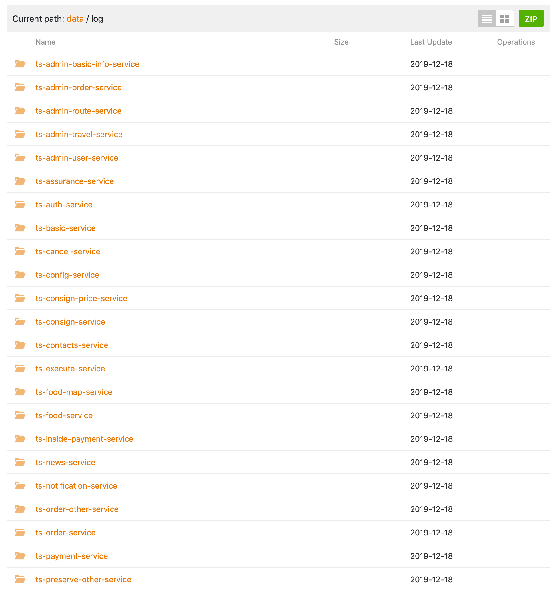

# CloudTsinghua-Downloader

**适用场景：** 共享文件夹，但是文件夹下文件众多，总体积多大，无法打包下载




### 使用方法

**环境：**  python3 (>= 3.5)

1. 修改conf.json中的id，此id即为共享文件夹的id

   e.g. 

   地址栏红色框中涂掉部位即为id

2. （Optional）配置conf文件中ignore项。

   * 输入文件全名（包含路径）=> 该文件不会被下载

   * 输入从根目录到指定目录的一个路径（需要以/结尾）=> 该目录下所有文件和目录均不会被下载

3. 

   ```
   cd CloudTsinghua-Downloader
   python3 download.py
   
   ```

4. 下载文件会被存储在CloudTsinghua-Downloader/Downloads下

 